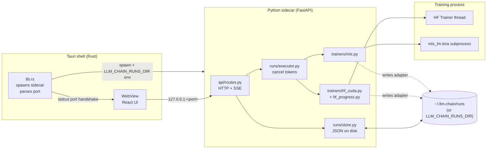
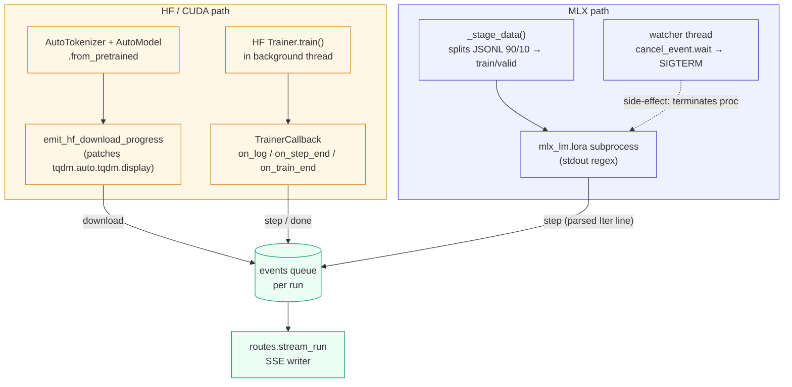
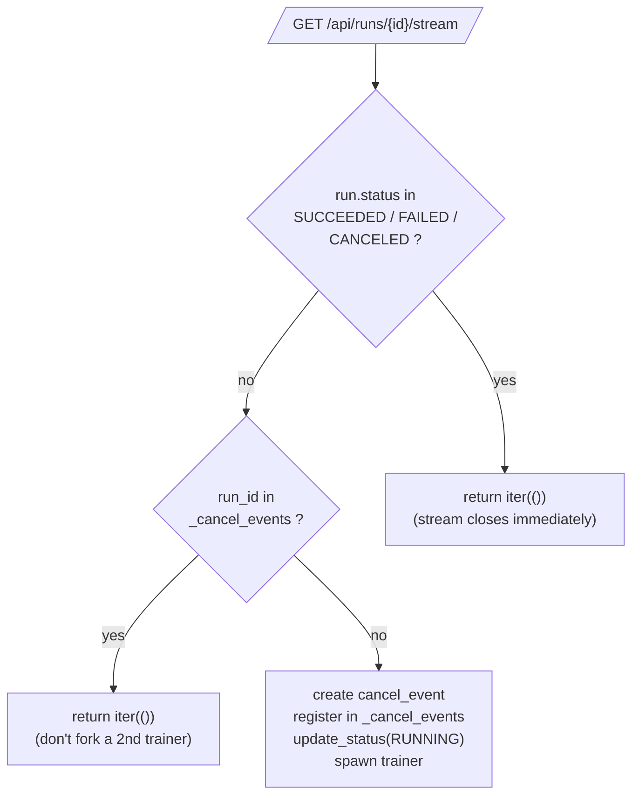
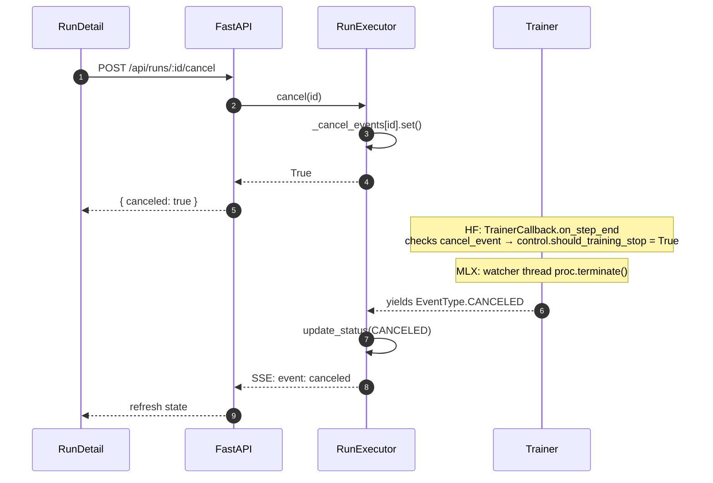

# How data flows through LLM-Chain

This is a runtime tour: what happens between a click on **Start training** in the UI and the loss value appearing on the chart. GitHub renders the Mermaid diagrams below in-line — no extra tooling needed.

If you only read one section, skim [Process layout](#process-layout), then jump to [A training run, end-to-end](#a-training-run-end-to-end).

---

## Process layout

Three processes share one machine. The Tauri shell hosts the WebView; the WebView talks to the FastAPI sidecar over loopback HTTP and SSE; the sidecar shells out to a trainer (in-process for HF/CUDA, subprocess for MLX).



Why three layers and not two: the sidecar holds the heavyweight Python ML stack (torch, transformers, peft, mlx_lm) in its own interpreter, so the Rust shell stays tiny and the WebView never has to know about Python. The shell-and-pipe handshake (a single `LLM_CHAIN_SIDECAR_PORT=NNNN` line on the sidecar's stdout) is how the Rust side discovers the dynamically-bound port without standing up extra IPC.

---

## A training run, end-to-end

Two HTTP calls drive a run:

1. `POST /api/runs` writes a `Run` record to disk and returns its `id`. **No training starts here.**
2. `GET /api/runs/{id}/stream` is the SSE endpoint. Opening it kicks the executor, which creates a trainer and yields events as they arrive. Closing the connection does not cancel — the executor finishes whatever it started.

```mermaid
sequenceDiagram
    autonumber
    participant UI as React (Train.tsx)
    participant Det as React (RunDetail)
    participant API as FastAPI routes
    participant Store as RunStore
    participant Exec as RunExecutor
    participant Tr as Trainer
    participant FS as runs dir

    UI->>API: POST /api/runs (RunConfig)
    API->>Store: store.create(cfg)
    Store->>FS: mkdir <id>; write run.json (PENDING)
    Store-->>API: Run(id, output_dir, PENDING)
    API-->>UI: { id, status: "pending" }
    UI->>Det: navigate(/runs/:id)
    Det->>API: EventSource GET /runs/:id/stream
    API->>Exec: execute(id)  (generator)
    Exec->>Store: update_status(RUNNING)
    Exec->>Tr: make_trainer(backend, cfg, output_dir, cancel_event)
    loop training events
        Tr-->>Exec: TrainingEvent (start | download | step | ...)
        Exec-->>API: yield ev
        API-->>Det: SSE: event: <type>\ndata: <json>
        Det->>Det: render chart point / progress bar / log line
    end
    Tr-->>Exec: DONE (or CANCELED / ERROR)
    Exec->>Store: update_status(SUCCEEDED / CANCELED / FAILED)
    Tr->>FS: write adapter weights to output_dir
    API-->>Det: SSE stream closes
```

Reading the diagram: steps 1–5 are just bookkeeping — a directory exists for the run with a `run.json` describing it, but nothing is training yet. The actual training starts only when the WebView opens the SSE stream in step 6. That's also why a browser auto-reconnect to the SSE endpoint **must not** restart the trainer; the executor's reconnect guards (see [Reconnect / cancel safety](#reconnect--cancel-safety)) make the second `execute()` a no-op.

The SSE event types the trainer emits — `start`, `download`, `step`, `epoch_end`, `done`, `error`, `canceled` — are defined in `trainers/base.py::EventType` and consumed in `apps/desktop/src/screens/Runs.tsx`.

---

## Where each event comes from



The HF and MLX trainers funnel into the same per-run queue with the same event shape, so the SSE writer (and the React side) doesn't need to know which backend produced an event. Two non-obvious wires:

- **Download progress.** `huggingface_hub` and `transformers` never exposed a per-download callback, but every download bar goes through `tqdm.auto.tqdm`. The `emit_hf_download_progress` context manager monkey-patches that class's `display()` method while `from_pretrained` runs, pushes throttled (1% buckets) `download` events onto the same queue, and restores the original method on exit.
- **MLX cancellation.** The `mlx_lm.lora` subprocess's `stdout.readline()` is blocking; if we polled `cancel_event` between reads we'd have at-most-one-step latency. A daemon watcher thread does `cancel_event.wait()` then `proc.terminate()`, which closes the pipe and unblocks the reader.

---

## Reconnect / cancel safety

Two cases that *look* like new runs but must not be:



Without these, a transient WiFi blip on a running run would trigger the browser EventSource to reopen the stream URL, which would call `execute()` a second time and either re-stream a finished run from scratch or fork a duplicate trainer racing into the same `output_dir`.

A **cancel** flows the other direction:



If `cancel(id)` is called for a run that isn't currently streaming (no entry in `_cancel_events`), the route returns **HTTP 409**: there's nothing in flight to signal.

---

## Where the bytes land

```
~/.llm-chain/runs/                # default; override with LLM_CHAIN_RUNS_DIR
└── <run_id>/                     # 12-char hex; run.id from RunStore.create()
    ├── run.json                  # serialized Run (config, status, error, output_dir)
    ├── adapter_model.safetensors # HF-CUDA path: peft adapter
    ├── adapter_config.json       # HF-CUDA path
    ├── _mlx_data/                # MLX path only: 90/10 train/valid staged JSONL
    │   ├── train.jsonl
    │   └── valid.jsonl
    └── adapters.safetensors      # MLX path: mlx_lm.lora output
```

Two ways this root gets chosen, in priority order:

1. **`LLM_CHAIN_RUNS_DIR`** env at sidecar startup — set by the Rust shell from `~/.llm-chain/desktop-settings.json` (written by the Settings screen) or by you when running the sidecar standalone.
2. **`~/.llm-chain/runs`** as the fallback used by `api/routes.py`.

Tests override this via `tests/conftest.py` so the suite never writes to your real home directory.

---

## Reading list when working on the runtime

- `sidecar/llm_chain_sidecar/api/routes.py` — HTTP + SSE surface
- `sidecar/llm_chain_sidecar/runs/executor.py` — cancellation tokens, reconnect guards
- `sidecar/llm_chain_sidecar/trainers/base.py` — `EventType`, `TrainingEvent`, `Trainer` ABC
- `sidecar/llm_chain_sidecar/trainers/hf_cuda.py` + `hf_progress.py` — HF path, tqdm bridge
- `sidecar/llm_chain_sidecar/trainers/mlx.py` — MLX subprocess + watcher thread
- `apps/desktop/src/api/client.ts` — `streamRun` reconnect-state callback
- `apps/desktop/src/screens/Runs.tsx` — chart, log, download bar, cancel button, reveal-in-Finder
- `apps/desktop/src-tauri/src/lib.rs` — sidecar spawn, env injection, `save_desktop_settings` command
